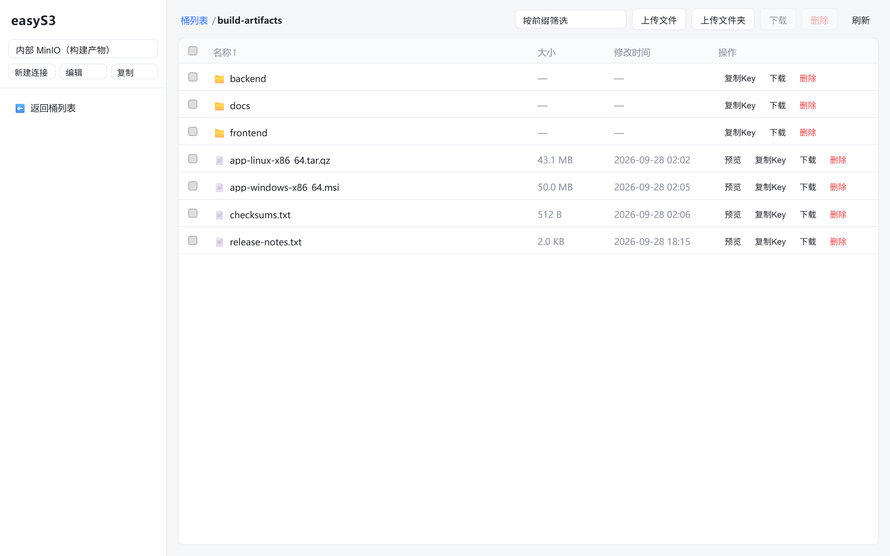
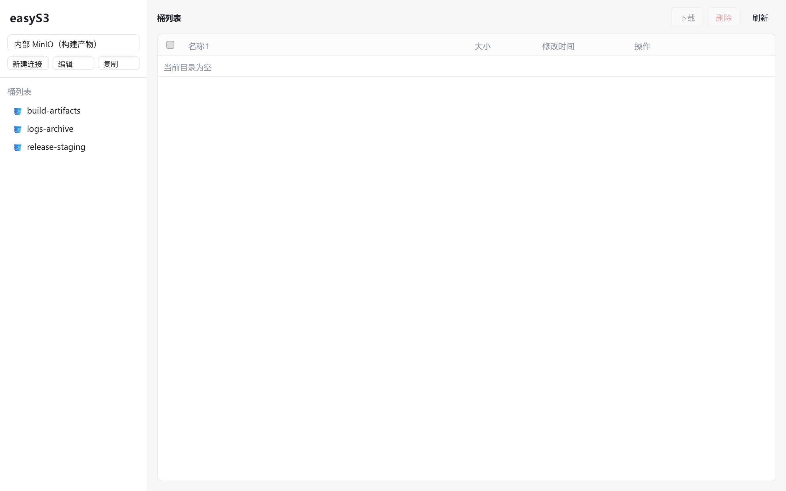
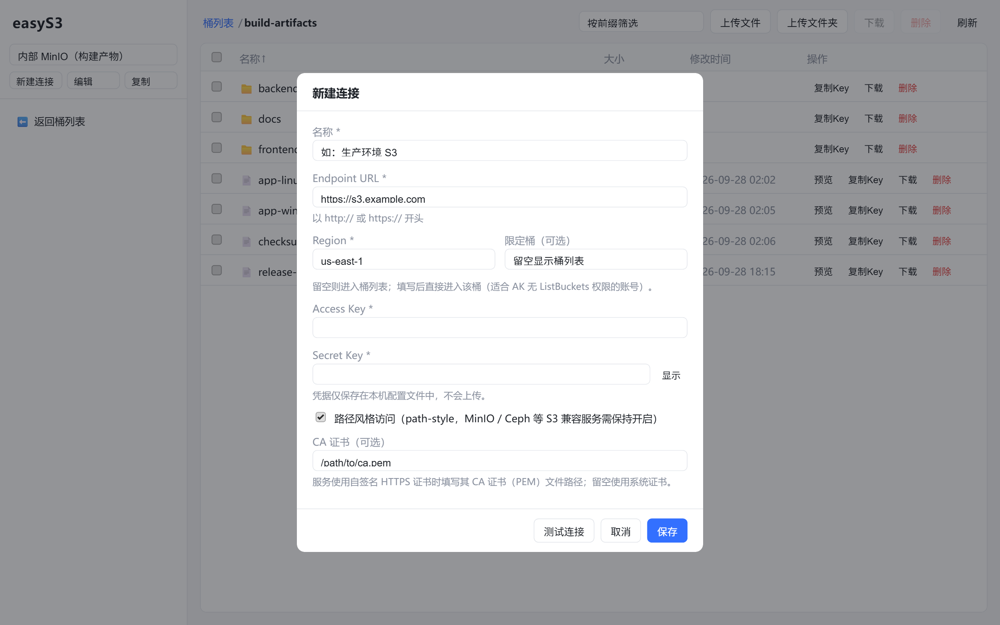
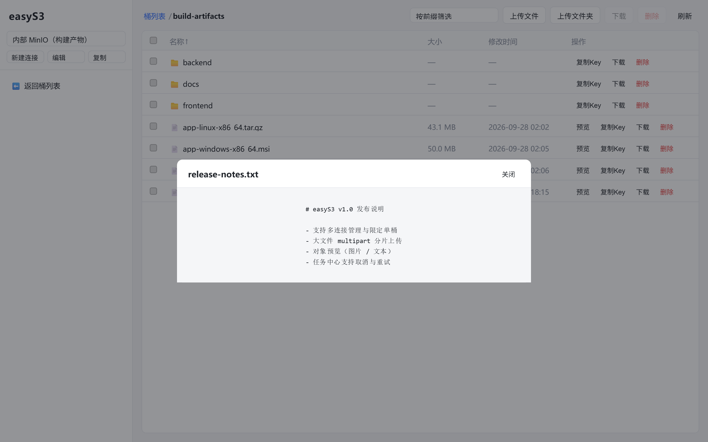
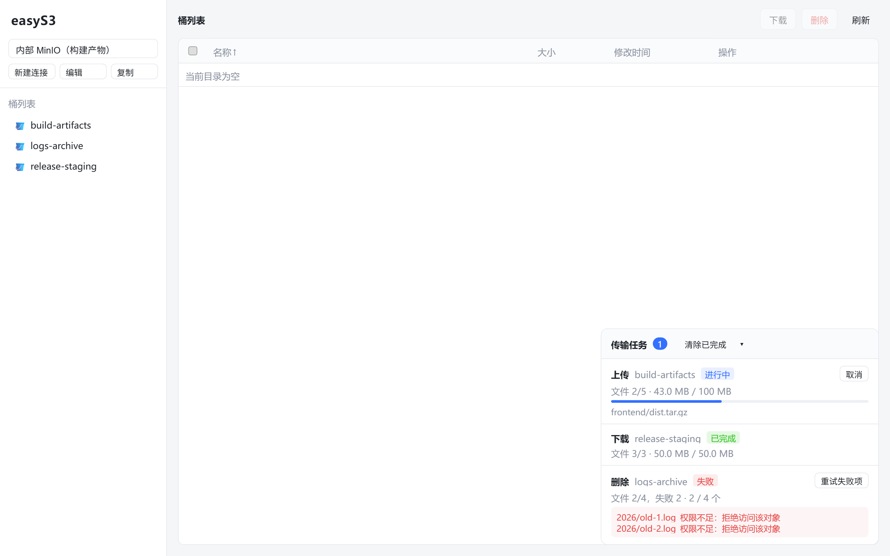

# easyS3

> An open-source Amazon S3 desktop client built with [Tauri 2](https://tauri.app/): a browse / upload / download / delete / preview tool for object storage, aimed at internal developers, operators and testers. Chinese UI, available on Windows / Linux / macOS.

[](LICENSE)
[](https://tauri.app/)
[](#download--install)
[](https://www.rust-lang.org/)
[](https://vuejs.org/)
[](CONTRIBUTING.md)

[简体中文](README.md) · **English**

---

## Table of Contents

- [Why easyS3](#why-easys3)
- [Features](#features)
- [Screenshots](#screenshots)
- [Download & Install](#download--install)
- [Build from Source](#build-from-source)
- [Usage](#usage)
- [Architecture](#architecture)
- [Project Structure](#project-structure)
- [Development & Verification](#development--verification)
- [Scope & Non-Goals](#scope--non-goals)
- [Contributing](#contributing)
- [Security](#security)
- [License](#license)

## Why easyS3

Command-line tools (`aws-cli`, `s3cmd`) are powerful but not intuitive for non-S3 experts. Web consoles usually target public clouds only, and struggle to manage self-hosted / on-premise S3-compatible services (MinIO, Ceph, and other object storage).

easyS3 turns everyday chores — "see what's in a bucket, drop files in, pull artifacts down, clean up stale objects" — into a one-click desktop experience:

- **Business-friendly vocabulary**: the UI only speaks "connection, bucket, folder, file", never exposing protocol terms like `prefix` or `multipart`.
- **One client for many S3 services**: each "connection" is a single S3 service configuration, switchable at any time.
- **Credentials never touch the webview**: every S3 request and secret is handled in the local Rust side; the frontend never sees AK/SK.
- **Cross-platform and ready to use**: native desktop apps for Windows / Linux / macOS, no command-line skills required.

## Features

| # | Feature | Description |
|---|---------|-------------|
| 1 | **Connection management** | Create / edit / delete S3 service configurations ("connections"), test a connection, switch the active one; single-bucket connections supported |
| 2 | **Listing** | Bucket list and object list; virtual directory tree, clickable breadcrumb, paginated loading, prefix filter, column sorting |
| 3 | **Upload** | File / folder upload preserving the relative directory structure; drag-and-drop from the OS file manager; automatic multipart for large files |
| 4 | **Download** | Download a single object or a whole "folder" (prefix) to disk, preserving the directory structure |
| 5 | **Delete** | Single / multi-select batch / whole-prefix delete, with confirmation and per-item failure reporting |
| 6 | **Object preview** | Preview images and UTF-8 text inline; oversized or binary files prompt to download instead |
| 7 | **Copy Key** | One click to copy an object's full Key for pasting into code or the CLI |
| 8 | **Task center** | A global floating panel listing running / finished / failed tasks, with cancel, retry and clear |

### Highlights

- **Multiple connections, optional single bucket**: a connection is an endpoint / region / AK / SK; you can optionally fill in `default_bucket`. When the account lacks `ListBuckets` permission, entering the bucket name skips the bucket list and goes straight in.
- **Multipart upload for large files**: `aws-sdk-s3`'s `put_object` does not chunk automatically, so easyS3 drives multipart manually (parts ≥ 5 MB, streaming reads, automatic `abort` on cancel / failure) without loading the whole file into memory.
- **Transfers decoupled from connections**: upload / download tasks hold their own client snapshot, so switching connections never interrupts a running task.
- **Readable, categorized errors**: connection, authentication, permission and not-found errors are classified into human-readable messages that never contain `secret_key`.
- **Credential safety baseline**: the config file is readable only by the current user (Unix `0600`), and secrets are redacted in error messages and logs.
- **Chinese and special-character filenames**: object Keys support Chinese, spaces and Unicode as-is; local filenames and Keys are converted without extra escaping.

## Screenshots

Main view: "connections + buckets" navigation on the left, the object list on the right, and a breadcrumb across the top for navigating back up the path.



| Bucket list | New connection |
| :---: | :---: |
|  |  |

| Object preview | Task center |
| :---: | :---: |
|  |  |

> Screenshots use demo data (fictional connections and objects) to illustrate the UI.

- Left pane: connection + bucket selection; right pane: object list. The top breadcrumb shows the current bucket / directory path and navigates back level by level.
- The task center is a global floating panel: running tasks show live progress, failed tasks offer "Retry".
- Friendly empty states: a setup guide when there are no connections, placeholders for empty buckets / directories.
- Drag-and-drop upload: drag files or folders from the OS file manager to upload into the current directory.

## Download & Install

Release packages are built per platform and available from the project's GitHub Releases page (or an internal artifact repository):

| Platform | Package format |
|----------|----------------|
| Windows | NSIS installer (`.exe`, x64) |
| Linux | AppImage, `.deb` (x86_64 and ARM64) |
| macOS | `.dmg` (Intel and Apple Silicon) |

> Note: **macOS packages must be built on macOS** — Tauri does not support cross-compiling to macOS. There is no auto-update yet; download a new version and install it over the old one.

### Unsigned installers

Release packages are currently **not code-signed**, so a security warning on first install or launch is expected:

| Platform | Possible warning | What to do |
|----------|------------------|------------|
| Windows | SmartScreen: "Windows protected your PC" | Click "More info" → "Run anyway" |
| macOS | Gatekeeper: "cannot verify the developer" or "damaged and can't be opened" | Right-click the app → "Open"; or run `xattr -cr /Applications/easyS3.app` |
| Linux | AppImage has no execute permission | `chmod +x easyS3_*.AppImage` |

Verify downloads against the `SHA256SUMS.txt` attached to each release (on Windows: `certutil -hashfile <file> SHA256`):

```bash
sha256sum -c SHA256SUMS.txt
```

## Build from Source

### Prerequisites

- [Node.js](https://nodejs.org/) and [pnpm](https://pnpm.io/)
- [Rust stable](https://www.rust-lang.org/tools/install)
- A C/C++ native toolchain (usually `build-essential` on Linux, MSVC Build Tools on Windows, Xcode Command Line Tools on macOS)
- The [Tauri 2 system dependencies](https://v2.tauri.app/start/prerequisites/) for your platform

On Debian/Ubuntu the native toolchain is typically installed with:

```bash
sudo apt install build-essential
```

### Build commands

```bash
pnpm install
pnpm tauri dev        # development
pnpm tauri build      # package for the current platform
```

To verify only the frontend, use `pnpm build`; the core Rust library can be verified independently with `cargo test -p easys3-core`.

The repository root also ships a `Makefile` that works on both Windows `cmd.exe` and POSIX shells (Git Bash / Linux / macOS):

```bash
make install          # install frontend dependencies
make tauri-dev        # start the desktop dev mode
make verify           # frontend build + fmt + clippy + tests
make release          # build the Tauri release package for this platform
make help             # list all targets
```

> On Windows, run these from an "x64 Native Tools Command Prompt for VS" or "Developer PowerShell for VS" so the MSVC toolchain is available. If Chinese text is garbled, run `chcp 65001` first.

### Targeting a platform

You can also select a build target via a Rust target triple:

```bash
make core-build TARGET=x86_64-unknown-linux-gnu
make release    TARGET=x86_64-unknown-linux-gnu
```

| Target | Platform |
| --- | --- |
| `x86_64-unknown-linux-gnu` | Linux x86_64 |
| `aarch64-unknown-linux-gnu` | Linux ARM64 |
| `x86_64-pc-windows-msvc` | Windows x86_64 (MSVC) |
| `aarch64-pc-windows-msvc` | Windows ARM64 (MSVC) |
| `x86_64-apple-darwin` | macOS Intel |
| `aarch64-apple-darwin` | macOS Apple Silicon |

Install the Rust target first with `rustup target add <target>`, and prepare the matching cross-compiler, linker and Tauri system dependencies. Cross-compilation does not bypass platform limits — for example, macOS packages should still be produced on macOS.

### Releasing a version

Use `VERSION` to keep the version in `package.json`, `Cargo.toml` and `src-tauri/tauri.conf.json` in sync:

```bash
make version VERSION=1.2.3
make release VERSION=1.2.3
```

Versions follow SemVer, e.g. `1.2.3` or `1.2.3-beta.1`. Without `VERSION`, `make release` uses the version currently in the files.

## Usage

1. **First run**: create a connection (name, endpoint, AK/SK) → test it → save → you land on the bucket list (or a restricted bucket).
2. **Everyday use**: pick a connection → bucket list → enter a bucket → browse the virtual directories → upload / download / delete / preview / copy Key.
3. **Switching connections**: possible at any time; in-progress upload / download tasks are neither interrupted nor cancelled.

## Architecture

easyS3 is layered to decouple business rules from the GUI / IPC, keeping the core logic independently testable:

```text
┌─────────────────────────────┐
│  Vue 3 + TypeScript frontend│  Chinese UI, state, task center
│  src/                       │  calls commands via invoke only; never touches S3 directly
├─────────────────────────────┤
│  Tauri glue layer           │  command orchestration, task lifecycle, progress events
│  src-tauri/                 │  orchestration only, no business logic
├─────────────────────────────┤
│  easys3-core (business)     │  config model, S3 operations, error classification
│  crates/easys3-core/        │  no GUI dependency, independently testable
└─────────────────────────────┘
```

**Stack**

| Layer | Choice |
|-------|--------|
| Desktop framework | Tauri 2.x |
| Backend / core | Rust (`aws-sdk-s3`, `tokio`, `serde`, `thiserror`, `uuid`) |
| Frontend | Vue 3 (`<script setup>`) + TypeScript + Vite |
| Package management | pnpm for the frontend, Cargo workspace for Rust |
| Platforms | Windows, Linux, macOS |

**Key implementation conventions**

- S3 requests and credentials live only in Rust and are exposed to the frontend via `#[tauri::command]`; the frontend never uses the AWS SDK or `fetch`es an S3 endpoint.
- Business logic always goes into `easys3-core`; `src-tauri` only orchestrates commands and manages task lifecycles.
- A task is a self-contained unit holding its own client snapshot, cancelled via `Arc<AtomicBool>`, with progress pushed through the `task-update` event (throttled to 50 ms).
- Connection configs live in `connections.json` under the system app config directory, read and written on the Rust side; the frontend never uses `localStorage`.

## Project Structure

| Directory | Description |
| --- | --- |
| `crates/easys3-core` | Core business library: config model, S3 operations, error classification (unit-tested, no GUI dependency) |
| `src-tauri` | Tauri glue layer: commands, transfer task executor, app state, capabilities ACL |
| `src` | Vue 3 + TypeScript frontend (Chinese UI): `api.ts`, `store.ts`, component directory |
| `.agents` | Business spec documents (single source of truth: scope, config model, operation behavior and red lines) |
| `.github` | Issue / PR templates |
| `scripts` | Build scripts such as version synchronization |

> The single source of truth for business rules is [`.agents/README.md`](.agents/README.md); engineering and toolchain conventions live in [`AGENTS.md`](AGENTS.md). Read the relevant spec before working on any business feature.

## Development & Verification

Common checks (all should pass before committing):

```bash
pnpm build                                                   # frontend type-check + build
cargo fmt --all -- --check                                   # format check
cargo clippy -p easys3-core --all-targets -- -D warnings     # clippy
cargo test -p easys3-core                                    # core unit tests
```

Or use the aggregate target:

```bash
make verify           # equivalent to frontend-build + fmt-check + clippy + test
```

`src-tauri` depends on system libraries such as WebKitGTK / WebView2 and cannot be compiled in environments without them (e.g. a container with no desktop libraries); in that case you can still verify `easys3-core` and the frontend independently. For a full desktop build, use Windows, macOS or a Linux machine with the [Tauri system dependencies](https://v2.tauri.app/start/prerequisites/) installed.

## Scope & Non-Goals

The following are **explicitly out of scope** for now (open an Issue to discuss if you need them):

- Bucket creation / deletion
- ACL / permission management, STS / temporary credentials
- Versioning (listing / restoring previous versions)
- Resumable transfers (a cancelled upload/download restarts from scratch)
- Cross-connection copy / sync / move
- Presigned URL sharing
- Persisting transfer tasks (tasks do not survive an app restart)
- Config import / export
- Auto-update (download a new installer and install over the old version)

## Contributing

Issues, code improvements and documentation contributions are welcome. Before you start, please read:

- [Contributing Guide](CONTRIBUTING.md) — dev environment, commit conventions and the PR checklist
- [Code of Conduct](CODE_OF_CONDUCT.md) — the ground rules for community collaboration

Please do not include real S3 endpoints, Access Keys, Secret Keys, bucket names or other sensitive information in Issues, logs or commits.

## Security

easyS3 handles S3 requests and credentials on the Rust side, but you are still responsible for protecting your local account, config files and the permissions of the connected service. Before reporting a vulnerability, read the [Security Policy](SECURITY.md) and report privately via GitHub Security Advisories; never disclose an unfixed vulnerability in a public Issue.

## License

easyS3 is released under the [MIT License](LICENSE).
